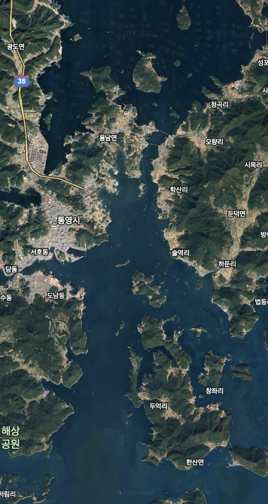
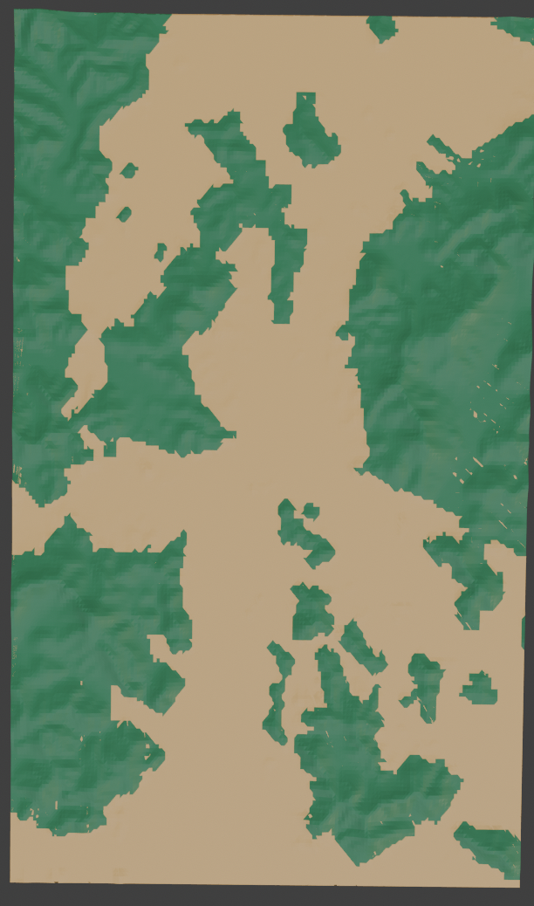

# madcamp_week4

## 개발 환경 ⚙️

Game engine : Unity URP

---

## 개발 팀원 🧑‍💻

홍성문: 한양대학교 컴퓨터소프트웨어학부

안호진: 카이스트 전기및전자공학부

---

## 게임 배경 🔖

임진왜란 발발후 일본군은 수륙병진계획으로 조선을 침범하고 있었다. 조선수군은 일본군이 견내량에 약 70척의 배가 주둔하고 있는것을 확인하였다. 이순신 장군은 견내량은 해엽이 좁고 암초가 많아서 판옥선이 자유롭게 전투하지 못할것이라 판단하였고 일본 수군을 한산도로 유인하는 계획을 세워 한산도 앞바다에서 전투할 계획을 세우는데..

---

## 맵 🗾

실제 한산도 대첩이 일어난 조선 견내량 한산도 앞 바다의 지형정보를 받아와 실제와 매우 유사하게 맵을 제작하여서 역사적으로 한산도 대첩에서 이순신 장군이 견내량이 좁다는 판단하에 유인작전을 한 배경을 사용자가 직접 체감할 수 있도록 제작하였습니다.

|||

## 조작방법 🎮

### 카메라 이동

w,a,s,d : 카메라 상하좌우 이동

q,e : 카메라 좌우 회전

c,v : 카메라 상하 회전

### 배 이동

- 마우스 우클릭으로 거북선 혹은 판옥선을 클릭하면 이동하기를 원하는 배를 선택할 수 있습니다.
- 선택된 배는 원하는 곳을 마우스 우클릭으로 지정하면 해당 방향으로 회전 한 후, 진행하게 됩니다.
- 또한 키보드 방향키를 사용해서 조작 할 수도 있습니다.
   

### 공격

- 배를 선택하면 나오는 UI를 누르면 나오는 버튼을 클릭하면 포가 발사됩니다.
- F1~F3 : 전방에 있는 포3개를 각각 발사
- L1~L8 : 좌측에 있는 포8개를 각각 발사
- R1~R8 : 우측에 있는 포8개를 각각 발사
- LA : 좌측에 있는 모든 포 발사
- RA : 우측에 있는 모든 포 발사
- Angle DN / Angle UP : 포의 발사각도 조절 (1,2,3단계)
- AL : 배를 180도 회전
- 학익진을 구성하고 있는 판옥선들의 공격은 일괄적으로 조작할 수 있습니다.
    - < , > 키 : 판옥선들의 좌측포/우측포 일괄 발포
    - M : 판옥선 일괄 회전
    - J : 판옥선들의 포 각도 상승
    - N : 판옥선들의 포 각도 하강

---

## 배 목록

### 거북선

- 기존 조선 수군의 주력함이던 판옥선을 개량한 것으로, 지붕을 덧씌워 방어력을 높이고 포문을 많이 설치하여 사격 공격을 용이하게 하도록 구조를 변경, 앞에는 용머리 형태의 충각 겸 포문을 달아 돌격적에도 용이하게 설계한것이 특징
- 사용한 모델

[Turtle ship (Geobukseon) | 거북선 | 龜船 | 沐海船 - Download Free 3D model by 융해열흡수 (@heat_of_fusion)](https://skfb.ly/ozELJ)

- 인게임

### 판옥선

- 조선 수군의 대표적인 주력 군함
- 사용한 모델

[Panok ship (Panokseon) | 판옥선 | 板屋船 - Download Free 3D model by 융해열흡수 (@heat_of_fusion)](https://skfb.ly/ozENz)

- 인게임
    

### 아타케부네 (안택선)

임진왜란 당시 일본 수군이 사용하던 대형 전투함.

### 세키부네

임진왜란 당시 일본 수군이 사용하던 중형의 전투함
